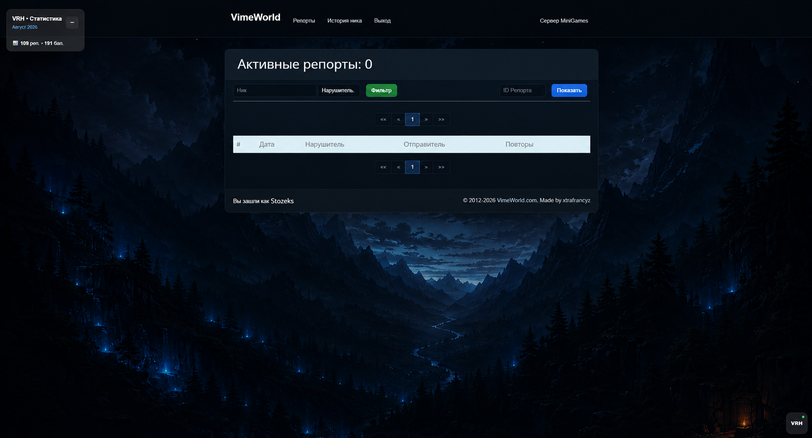
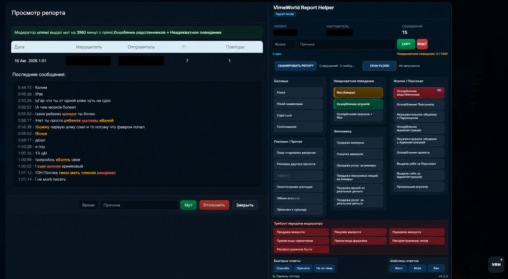
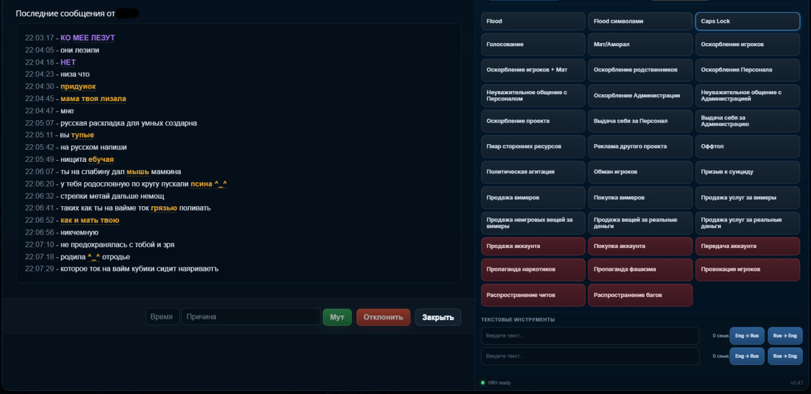
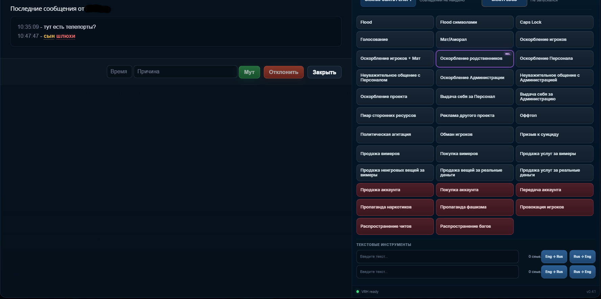
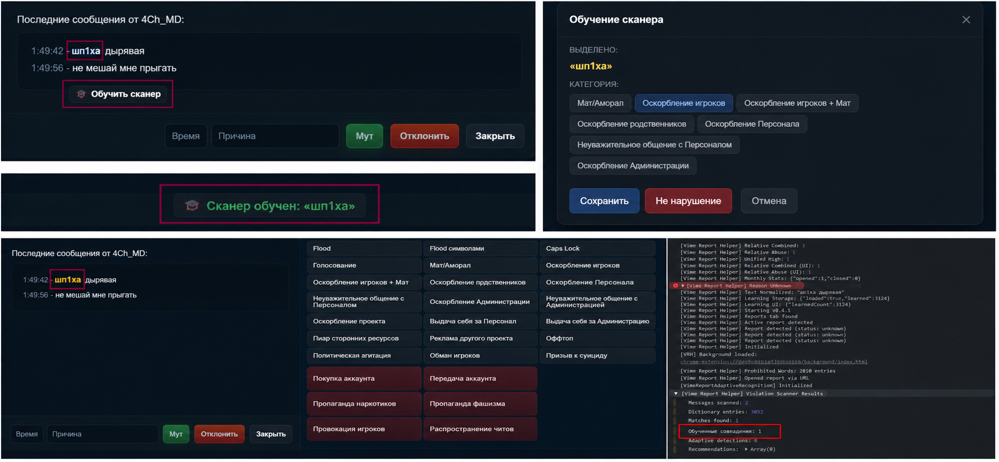

# VimeWorld Report Helper

> Локальный инструмент поддержки модерации для VimeWorld Reports.

**VimeWorld Report Helper (VRH)** расширяет стандартный интерфейс Reports и помогает быстрее анализировать игровые сообщения, находить потенциальные нарушения и принимать решение по репорту.

VRH объединяет классическое сканирование, нормализацию текста, контекстный анализ, Adaptive Recognition и локальное обучение на подтверждённых модератором случаях.

Система не принимает решение за модератора — она **находит, классифицирует и объясняет**, оставляя окончательное решение человеку.

### Что умеет VRH

- 🔎 анализировать сообщения репорта и подсвечивать найденные нарушения;
- 🧠 распознавать искажённые слова, обходы и нестандартные формы;
- 🎓 обучаться новым вариантам через локальный Learning Store;
- 🧩 учитывать контекст между сообщениями;
- 🏷️ классифицировать нарушения и рекомендовать соответствующие причины;
- 🎨 подсвечивать плитки причин разными цветами в зависимости от категории;
- 🛡️ учитывать исключения и снижать количество false positives;
- 📊 проверять качество сканера через Scanner Benchmark;
- ⚡ ускорять обработку репортов, не автоматизируя само наказание.

---

### Основной принцип

```text
REPORT
   ↓
MESSAGE ANALYSIS
   ↓
NORMALIZATION
   ↓
OFFICIAL + BUILT-IN + LEARNED KNOWLEDGE
   ↓
CONTEXT & ADAPTIVE RECOGNITION
   ↓
VIOLATION CLASSIFICATION
   ↓
HIGHLIGHTING & REASON RECOMMENDATION
   ↓
MODERATOR DECISION
```

<p align="center">
  
</p>

<p align="center">
  <sub>
    VimeWorld Reports с установленным VRH: рабочая панель, инструменты анализа
    и локальная система поддержки модерации непосредственно в интерфейсе репортов.
  </sub>
</p>

> **VRH помогает модератору увидеть больше и проверить быстрее, но не заменяет решение модератора.**

> Проект находится в активной разработке. Некоторые системы ещё дорабатываются и могут меняться.

---

## Что уже есть

### Панель Report Helper

При открытии репорта справа появляется отдельная рабочая панель.

В ней отображаются:

- ID репорта;
- ник нарушителя;
- количество сообщений;
- время наказания;
- выбранная причина;
- быстрый выбор причин;
- кнопки Copy / Reset;
- запуск обычного сканера;
- запуск Flood Scanner;
- текстовые инструменты;
- состояние расширения.

Панель работает поверх существующей страницы репортов и не заменяет оригинальный интерфейс VimeWorld.

### Информация об игроках

В VRH появился отдельный слой **Player Identity** для работы с информацией об игроках прямо в интерфейсе репорта.

Он отвечает за получение, кэширование и отображение данных игрока, включая:

- игровые головы;
- никнеймы;
- отображение рангов;
- оригинальные цвета рангов;
- корректное определение ранга даже при использовании кастомного текста префикса;
- дополнительное визуальное оформление информации об игроке.

Логика Player Identity вынесена отдельно от сканера и основной панели, чтобы получение данных игроков не было связано с механизмом поиска нарушений.

### Почему здесь нет скриншотов Player Identity

Часть этой системы работает с данными, которые отображаются на внутренней странице VimeWorld Reports.

Поэтому скриншоты, демонстрирующие реальные игровые головы, ранги, кастомные префиксы и связанные с ними данные пользователей, **намеренно не публикуются в открытом репозитории**.

Сам функционал является частью VRH, однако публичная документация описывает его без раскрытия конфиденциальной информации и содержимого внутренней страницы.

<p align="center">
  
</p>

<p align="center">
  <sub>
    Обновлённый интерфейс VimeWorld Report Helper после сканирования репорта:
    сканер определяет типы найденных нарушений и автоматически подсвечивает
    соответствующие плитки причин в панели.
  </sub>
</p>

На скриншоте показана актуальная версия панели VRH с обновлённым дизайном и системой визуальных рекомендаций.

После сканирования репорта найденные нарушения автоматически связываются с соответствующими причинами. Плитки получают отдельную цветовую подсветку в зависимости от обнаруженной категории — например, **«Мат/Аморал»**, **«Оскорбление игроков»** или **«Оскорбление родственников»**.

Это позволяет модератору сразу видеть результат анализа непосредственно в основной панели, не открывая дополнительные окна и не просматривая результаты сканирования вручную.

Подсветка является рекомендацией VRH и не выполняет наказание автоматически — окончательное решение остаётся за модератором.

---

## Сканер нарушений

Кнопка **«СКАНИРОВАТЬ РЕПОРТ»** проверяет сообщения игрока и пытается найти потенциальные нарушения.

Сканирование уже не сводится к обычному поиску точного слова в словаре. Перед проверкой текст проходит несколько этапов обработки, после чего результаты разных систем объединяются.

Сейчас сканер умеет работать, в том числе, с такими категориями, как:

- мат / аморал;
- оскорбление игроков;
- оскорбление игроков + мат;
- оскорбление родственников;
- оскорбление персонала;
- неуважительное общение;
- и другие причины, используемые при обработке репортов.

Найденные места подсвечиваются прямо внутри сообщений.

При обнаружении нарушения сканер подсвечивает не только найденное слово или фразу в сообщении, но и соответствующую **плитку причины** в панели Report Helper.

После поиска совпадений отдельно запускается классификация результата. Она определяет наиболее подходящую официальную категорию и передаёт рекомендацию интерфейсу.

Благодаря этому даже найденное после нормализации или восстановления искажённое слово может правильно подсветить нужную плитку.

Если подходит несколько категорий, более конкретная рекомендация получает приоритет.

Например, система различает:

```text
Оскорбление игроков + Мат
Оскорбление игроков
Мат/Аморал
```

Подсветка плитки остаётся только рекомендацией сканера и не означает автоматическое вынесение наказания.

<p align="center">
  
</p>

<p align="center">
  <sub>Сканер выделяет подозрительные слова и фразы непосредственно в истории сообщений.</sub>
</p>

<p align="center">
  
</p>

<p align="center">
  <sub>Вместе с найденной фразой VRH отмечает категорию, к которой сканер отнёс нарушение.</sub>
</p>

Официальные причины наказаний не генерируются расширением и не изменяются системой обучения.

---

## Нормализация и обходы написания

Одна из основных проблем обычного словарного сканера — игроку необязательно писать запрещённое слово в его исходном виде.

В сообщениях могут использоваться:

- замены букв символами;
- цифры вместо букв;
- смешивание кириллицы и латиницы;
- неправильная раскладка;
- дополнительные символы внутри слова;
- повторение букв;
- намеренные опечатки;
- разделение слова;
- визуально похожие символы.

Поэтому перед частью проверок VRH строит нормализованное представление текста.

Например, исходная строка может выглядеть совершенно иначе, чем слово, которое в итоге анализирует движок.

При этом подсветка остаётся привязанной к исходному сообщению, чтобы модератор видел реальный текст игрока, а не внутреннее нормализованное представление.

Эта часть проекта постепенно стала отдельным слоем распознавания, а не просто набором замен символов.

---

## Built-in Recognition

Помимо официальной базы, в VRH развивается собственный встроенный слой распознавания известных вариантов написания.

Его задача — хранить безопасные варианты, которые уже известны проекту и могут использоваться сразу после установки расширения.

Этот слой нужен для случаев, которые неудобно или неправильно добавлять непосредственно в официальный список слов:

- распространённые искажения;
- устойчивые обходы;
- известные варианты с заменой символов;
- формы, требующие дополнительной нормализации;
- варианты, для которых необходимо отдельно учитывать границы слова.

Built-in Recognition не изменяет официальные причины наказаний.

Он только помогает распознать текст и передать найденный результат существующей системе классификации.

Особое внимание здесь уделяется защите от false positive: короткая последовательность букв не должна считаться нарушением только потому, что случайно встретилась внутри обычного слова.

---

## Контекст между сообщениями

Одного поиска по словарю часто недостаточно.

Например, несколько обычных сообщений по отдельности могут образовывать нарушение только вместе. Поэтому в VRH есть отдельная система анализа связанных сообщений.

Она пытается учитывать:

- соседние сообщения;
- обращение к другому игроку;
- упоминание родственников;
- относительные оскорбления;
- разделённые между сообщениями фразы;
- некоторые способы обхода обычного поиска.

Для этого используются отдельные модули `Relative Context` и `Relative Abuse`.

Если нарушение определяется именно через связь между сообщениями, соответствующая плитка причины также может быть отмечена в панели.

Для таких срабатываний используется отдельная метка `REL`, чтобы их можно было отличить от обычного словарного совпадения.

---

## Подсветка сообщений

Все найденные совпадения выводятся непосредственно в истории сообщений.

Разные типы совпадений могут подсвечиваться по-разному, чтобы во время просмотра репорта было понятно, на что именно обратил внимание сканер.

Подсветка работает сразу на двух уровнях:

- **в сообщениях** — выделяется конкретное слово или фрагмент текста;
- **в панели Report Helper** — выделяется предполагаемая категория нарушения.

Это позволяет быстро увидеть не только **что именно** нашёл сканер, но и **к какой категории он отнёс результат**.

Подсветка собрана через отдельный `Unified Highlighter`, чтобы разные системы анализа не пытались независимо менять одни и те же сообщения.

---

## Adaptive Recognition

Игроки редко пишут запрещённые слова идеально.

Они могут заменять буквы, смешивать раскладки, добавлять символы, делать опечатки или специально коверкать слово.

Для таких случаев в проекте развивается отдельный слой **Adaptive Recognition**.

Сейчас в него входят:

- нормализация текста;
- fuzzy matching;
- recognition engine;
- обработка похожих написаний;
- восстановление части намеренно искажённых слов;
- built-in recognition aliases;
- отдельное хранилище накопленных знаний;
- система обучения;
- исключения для защиты от ложных срабатываний;
- тестовый модуль для проверки распознавания;
- Scanner Benchmark для регрессионных проверок.

Главная задача этой системы — находить варианты, которые невозможно нормально покрыть одним огромным списком слов, не превращая при этом сканер в источник постоянных ложных срабатываний.

---

## 🎓 Обучение сканера

Сканер не ограничен только заранее подготовленным словарём.

Если во время проверки он не распознал нарушение, модератор может выделить нужное слово или фразу прямо в сообщении и нажать:

**🎓 Обучить сканер**

После этого выбирается категория нарушения, к которой относится выделенный текст.

Например, сканер может не знать намеренно исковерканный вариант слова.

Модератор отмечает его как нужную категорию, после чего вариант сохраняется в отдельные накопленные знания сканера.

<p align="center">
  
</p>

<p align="center">
  <sub>Полный цикл обучения: неизвестный вариант → ручное подтверждение модератором → сохранение → обнаружение при повторном сканировании.</sub>
</p>

При следующем сканировании этот вариант уже может учитываться системой и отображаться как **обученное совпадение**.

При этом обучение **не изменяет официальный словарь проекта**.

Новые варианты хранятся отдельно, поэтому накопленные знания можно контролировать независимо от исходной базы.

Смысл этой системы простой: реальные подтверждённые случаи постепенно помогают сканеру лучше понимать опечатки, обходы фильтров и нестандартные варианты написания.

---

## Разделение баз знаний

После появления встроенного распознавания и обучения стало особенно важно не смешивать всё в один файл.

Сейчас логика строится вокруг нескольких независимых источников:

```text
Официальная база
        +
Built-in Recognition
        +
Накопленные знания
        +
Контекстные правила
        +
Исключения
        ↓
Общий результат сканирования
```

У каждого слоя своя задача.

**Официальная база** остаётся исходной основой.

**Built-in Recognition** содержит известные проекту варианты распознавания.

**Накопленные знания** появляются после подтверждения модератором.

**Контекстные правила** работают с тем, что невозможно определить по одному слову.

**Исключения** защищают от известных ложных срабатываний.

Так новые механики можно развивать отдельно, не изменяя официальные формулировки причин и не смешивая экспериментальные знания с основной базой.

---

## Исключения и false positive

Обучение нужно не только для добавления новых нарушений.

Если сканер считает обычное слово нарушением, такой случай должен обрабатываться отдельно, а не исправляться удалением полезного правила.

Для этого в проекте предусмотрены исключения и дополнительные проверки границ слова.

Особенно это важно для коротких корней и сокращений: совпадение внутри длинного обычного слова ещё не означает нарушение.

Поэтому при развитии распознавания проверяется не только способность сканера **найти больше**, но и способность **не находить лишнее**.

---

## Scanner Benchmark

Для сканера появился отдельный набор регрессионных проверок.

Он нужен для того, чтобы изменения в нормализации, aliases и правилах распознавания не исправляли один случай ценой десятка новых ошибок.

Проверки разделяются по смыслу на две основные группы:

```text
SHOULD MATCH
SHOULD NOT MATCH
```

Первая содержит варианты, которые сканер должен распознавать.

Вторая — обычные и пограничные строки, на которых срабатывания быть не должно.

Benchmark позволяет после изменений быстро проверить как новые обходы, так и уже работающие случаи.

Кроме обычного количества пройденных тестов, он позволяет следить за качеством распознавания через:

- False Positive;
- False Negative;
- ошибки классификации;
- Accuracy;
- Precision;
- Recall.

Это особенно важно для Adaptive Recognition.

Правило, которое исправило один редкий обход, не должно внезапно начать считать нарушением десятки обычных сообщений.

Поэтому Scanner Benchmark постепенно становится постоянной защитой сканера от регрессий.

---

## Flood Scanner

Flood Scanner работает отдельно от обычного поиска нарушений.

Он проверяет сообщения на:

- обычный flood;
- flood символами;
- повторяющиеся сообщения;
- другие связанные признаки.

Результат выводится рядом с кнопкой запуска сканирования.

Обычный Violation Scanner и Flood Scanner намеренно остаются отдельными системами, потому что решают разные задачи.

---

## Статистика

VRH ведёт локальную статистику работы.

Сейчас отображаются:

- количество закрытых репортов;
- количество отклонённых репортов;
- общее количество обработанных репортов;
- заработанные баллы;
- прогресс за текущий месяц.

Статистика хранится локально.

---

## Текстовые инструменты

В панели есть небольшие инструменты для работы с текстом.

Например, можно вставить сообщение с неправильной раскладкой и преобразовать его между:

```text
ENG → RUS
RUS → ENG
```

Это удобно для сообщений, где игрок написал русскую фразу в английской раскладке или наоборот.

---

## Как примерно проходит сканирование

Сильно упрощённо текущая схема выглядит так:

```text
Репорт
  ↓
Получение сообщений
  ↓
Нормализация текста
  ↓
Официальная база и правила
  ↓
Built-in Recognition
  ↓
Контекстный анализ
  ↓
Relative Abuse
  ↓
Adaptive Recognition
  ↓
Накопленные знания
  ↓
Исключения / защита от false positive
  ↓
Объединение результатов
  ↓
Классификация нарушения
  ↓
Подсветка сообщения
  ↓
Подсветка предполагаемой плитки
  ↓
Решение модератора
```

Последний пункт здесь самый важный.

**VRH не выдаёт наказания самостоятельно.**

Расширение помогает найти подозрительные места, восстановить некоторые искажённые написания, определить предполагаемую категорию и быстрее обработать репорт, но окончательное решение всё равно принимает модератор.

---

## Структура проекта

По мере роста VRH логика продолжает разделяться на небольшие модули.

Упрощённо основные части проекта сейчас выглядят так:

```text
src/
├── assets/
│
├── core/
│   └── dom-adapter.js
│
├── data/
│   ├── prohibited-roots.js
│   ├── prohibited-words.js
│   ├── prohibited-words.txt
│   ├── recognition-aliases.js
│   ├── relative-abuse-rules.js
│   ├── relative-context-rules.js
│   ├── scanner-exceptions.js
│   └── violation-rules.js
│
├── features/
│   ├── adaptive-recognition/
│   │   ├── fuzzy-matcher.js
│   │   ├── learning-store.js
│   │   ├── learning-ui.js
│   │   ├── recognition-engine.js
│   │   ├── recognition-test-harness.js
│   │   ├── scanner-benchmark.js
│   │   └── text-normalizer.js
│   │
│   ├── player-identity/
│   │   ├── player-api.js
│   │   ├── player-cache.js
│   │   ├── player-identity.js
│   │   └── player-identity-ui.js
│   │
│   ├── flood-scanner.js
│   ├── message-parser.js
│   ├── monthly-stats.js
│   ├── reason-undo.js
│   ├── relative-abuse-detector.js
│   ├── relative-abuse-highlighter.js
│   ├── relative-abuse-integration.js
│   ├── relative-context-detector.js
│   ├── unified-highlighter.js
│   └── violation-scanner.js
│
├── styles/
│   ├── relative-context.css
│   ├── report-helper.css
│   └── vimeworld-theme.css
│
├── ui/
│   └── report-panel.js
│
└── content.js
```

Код специально разбивается по назначению.

Сканер, интерфейс, данные игроков, обучение, контекстный анализ и работа с DOM уже достаточно большие системы, поэтому держать их в одном файле было бы неудобно и намного сложнее тестировать.

---

## Локальные данные

VRH не требует отдельного аккаунта или собственного сервера для хранения настроек расширения.

Настройки, статистика и накопленные знания хранятся локально в браузере.

В частности, система обучения использует `chrome.storage.local`.

Официальная база, встроенное распознавание и накопленные пользователем знания при этом остаются разными слоями.

Это сделано намеренно: текущая версия проекта не нуждается в облачной синхронизации для своей основной работы.

---

## Конфиденциальность

VRH работает поверх внутренней страницы репортов, поэтому не все возможности проекта можно полностью показать в публичной документации.

В открытом README намеренно не публикуются изображения, на которых могут быть видны:

- данные пользователей;
- реальные игровые головы;
- ранги и связанная с ними информация;
- кастомные префиксы пользователей;
- элементы внутренней страницы;
- другая информация, которую не следует публиковать за пределами рабочего интерфейса.

По этой причине часть новых возможностей, особенно система **Player Identity**, описана в README текстом без реальных демонстрационных изображений.

Это ограничение касается только публичной демонстрации.

Сами функции продолжают использоваться и развиваться внутри проекта.

---

## Что дальше

Проект ещё не закончен.

Из ближайших направлений:

- дальнейшая оптимизация скорости сканирования;
- развитие Adaptive Recognition;
- расширение встроенного слоя распознавания;
- улучшение работы с контекстом;
- усиление защиты от false positive;
- расширение Scanner Benchmark;
- более удобное управление накопленными знаниями;
- возможность отменять ошибочное обучение;
- дальнейшее развитие Player Identity;
- развитие интерфейса;
- дополнительные инструменты для модератора;
- тестирование сканера на реальных репортах.

Новые функции добавляются постепенно — после того, как предыдущие нормально работают на реальной странице.

---

## Важно

VimeWorld Report Helper создаётся как вспомогательный инструмент.

Он не должен самостоятельно решать, виноват игрок или нет, и не должен автоматически выдавать наказания.

Сканер может ошибаться, особенно при сложном контексте, сленге, новых обходах или намеренно искажённом тексте.

Автоматическая подсветка категории тоже является только рекомендацией сканера.

Поэтому результат анализа — это **подсказка для модератора, а не готовый вердикт**.

---

**VimeWorld Report Helper**  
Разработка: **Stozeks**
