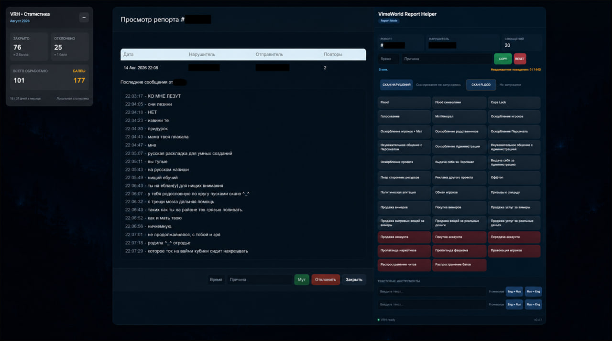

# VimeWorld Report Helper

**VimeWorld Report Helper (VRH)** — браузерное расширение, которое я делаю для упрощения работы с репортами VimeWorld.

Изначально идея была довольно простой: добавить к странице репортов удобную панель с быстрым выбором причин и несколькими полезными инструментами.

Постепенно проект вырос сильнее, чем планировалось. Сейчас VRH умеет не только дополнять интерфейс страницы, но и самостоятельно разбирать сообщения из репорта, искать возможные нарушения, учитывать контекст и запоминать новые варианты написания после подтверждения модератором.

<p align="center">
  
</p>

> Проект находится в активной разработке. Некоторые системы ещё дорабатываются и могут меняться.

---

## Что уже есть

### Панель Report Helper

При открытии репорта справа появляется отдельная рабочая панель.

В ней отображаются:

- ID репорта;
- ник нарушителя;
- количество сообщений;
- время наказания;
- выбранная причина;
- быстрый выбор причин;
- кнопки Copy / Reset;
- запуск обычного сканера;
- запуск Flood Scanner;
- текстовые инструменты;
- состояние расширения.

Панель работает поверх существующей страницы репортов и не заменяет оригинальный интерфейс VimeWorld.

<p align="center">
  
</p>

<p align="center">
  <sub>Открытый репорт с рабочей панелью VimeWorld Report Helper.</sub>
</p>

---

## Сканер нарушений

Кнопка **«СКАНИРОВАТЬ РЕПОРТ»** проверяет сообщения игрока и пытается найти потенциальные нарушения.

Сканер работает с официальной базой слов и правил, а найденные места подсвечиваются прямо внутри сообщений.

Сейчас он умеет работать, в том числе, с такими категориями, как:

- мат / аморал;
- оскорбление игроков;
- оскорбление игроков + мат;
- оскорбление родственников;
- оскорбление персонала;
- неуважительное общение;
- и другие причины, используемые при обработке репортов.

Официальные причины наказаний не генерируются расширением и не изменяются системой обучения.

---

## Контекст между сообщениями

Одного поиска по словарю часто недостаточно.

Например, несколько обычных сообщений по отдельности могут образовывать нарушение только вместе. Поэтому в VRH есть отдельная система анализа связанных сообщений.

Она пытается учитывать:

- соседние сообщения;
- обращение к другому игроку;
- упоминание родственников;
- относительные оскорбления;
- разделённые между сообщениями фразы;
- некоторые способы обхода обычного поиска.

Для этого используются отдельные модули `Relative Context` и `Relative Abuse`.

---

## Подсветка сообщений

Все найденные совпадения выводятся непосредственно в истории сообщений.

Разные типы совпадений могут подсвечиваться по-разному, чтобы во время просмотра репорта было понятно, на что именно обратил внимание сканер.

Подсветка собрана через отдельный `Unified Highlighter`, чтобы разные системы анализа не пытались независимо менять одни и те же сообщения.

<p align="center">
  
</p>

<p align="center">
  <sub>Пример работы сканера: найденные нарушения и связанные фрагменты подсвечиваются прямо в истории сообщений.</sub>
</p>

---

## Adaptive Recognition

## Adaptive Recognition

Игроки редко пишут запрещённые слова идеально.

Они могут заменять буквы, смешивать раскладки, добавлять символы, делать опечатки или специально коверкать слово.

Для таких случаев в проекте постепенно развивается отдельный слой **Adaptive Recognition**.

Сейчас в него входят:

- нормализация текста;
- fuzzy matching;
- recognition engine;
- обработка похожих написаний;
- отдельное хранилище знаний;
- система обучения;
- тестовый модуль для проверки распознавания.

Главная задача этой системы — находить варианты, которые невозможно нормально покрыть одним огромным списком слов.

---

## 🎓 Обучение сканера

Сканер не ограничен только заранее подготовленным словарём.

Если во время проверки он не распознал нарушение, модератор может выделить нужное слово или фразу прямо в сообщении и нажать:

**🎓 Обучить сканер**

После этого выбирается категория нарушения, к которой относится выделенный текст.

Например, сканер может не знать намеренно исковерканный вариант слова:

`шп1ха`

Модератор отмечает его как **«Оскорбление игроков»**, после чего вариант сохраняется в отдельные накопленные знания сканера.

<p align="center">
  
</p>

<p align="center">
  <sub>Полный цикл обучения: неизвестный вариант → ручное подтверждение модератором → сохранение → обнаружение при повторном сканировании.</sub>
</p>

При следующем сканировании этот вариант уже учитывается системой и отображается как **обученное совпадение**.

При этом обучение не изменяет официальный словарь проекта. Новые варианты хранятся отдельно, поэтому ошибочное обучение можно контролировать и в дальнейшем отменять.

Смысл этой системы простой: чем больше реальных случаев проходит через модератора, тем лучше сканер начинает понимать опечатки, обходы фильтров и нестандартные варианты написания.
---

## Исключения и ошибки сканера

Обучение нужно не только для добавления новых нарушений.

Если сканер считает обычное слово нарушением, его можно добавить в исключения.

Это позволяет постепенно уменьшать количество ложных срабатываний, не ломая основной словарь и правила сканирования.

Официальная база и накопленные знания специально разделены:

```text
Официальные правила
        +
Накопленные знания
        +
Исключения
        ↓
Результат сканирования
```

Так экспериментальная логика не изменяет исходные данные VimeWorld.

---

## Flood Scanner

Flood Scanner работает отдельно от обычного поиска нарушений.

Он проверяет сообщения на:

- обычный flood;
- flood символами;
- повторяющиеся сообщения;
- другие связанные признаки.

Результат выводится рядом с кнопкой запуска сканирования.

---

## Статистика

VRH ведёт локальную статистику работы.

Сейчас отображаются:

- количество закрытых репортов;
- количество отклонённых репортов;
- общее количество обработанных репортов;
- заработанные баллы;
- прогресс за текущий месяц.

Статистика хранится локально.

---

## Текстовые инструменты

В панели есть небольшие инструменты для работы с текстом.

Например, можно вставить сообщение с неправильной раскладкой и преобразовать его между:

```text
ENG → RUS
RUS → ENG
```

Это удобно для сообщений, где игрок написал русскую фразу в английской раскладке или наоборот.

---

## Как примерно проходит сканирование

Сильно упрощённо текущая схема выглядит так:

```text
Репорт
  ↓
Получение сообщений
  ↓
Официальная база и правила
  ↓
Контекстный анализ
  ↓
Relative Abuse
  ↓
Adaptive Recognition
  ↓
Накопленные знания
  ↓
Исключения
  ↓
Объединение результатов
  ↓
Подсветка сообщений
  ↓
Решение модератора
```

Последний пункт здесь самый важный.

**VRH не выдаёт наказания самостоятельно.**

Расширение помогает найти подозрительные места и быстрее обработать репорт, но решение всё равно принимает модератор.

---

## Структура проекта

Основная логика сейчас разделена по назначению:

```text
src/
├── assets/
│
├── core/
│   └── dom-adapter.js
│
├── data/
│   ├── prohibited-roots.js
│   ├── prohibited-words.js
│   ├── prohibited-words.txt
│   ├── relative-abuse-rules.js
│   ├── relative-context-rules.js
│   ├── scanner-exceptions.js
│   └── violation-rules.js
│
├── features/
│   ├── adaptive-recognition/
│   │   ├── fuzzy-matcher.js
│   │   ├── learning-store.js
│   │   ├── learning-ui.js
│   │   ├── recognition-engine.js
│   │   ├── recognition-test-harness.js
│   │   └── text-normalizer.js
│   │
│   ├── flood-scanner.js
│   ├── message-parser.js
│   ├── monthly-stats.js
│   ├── reason-undo.js
│   ├── relative-abuse-detector.js
│   ├── relative-abuse-highlighter.js
│   ├── relative-abuse-integration.js
│   ├── relative-context-detector.js
│   ├── unified-highlighter.js
│   └── violation-scanner.js
│
├── styles/
│   ├── relative-context.css
│   ├── report-helper.css
│   └── vimeworld-theme.css
│
├── ui/
│   └── report-panel.js
│
└── content.js
```

Код специально разбивается на отдельные модули, потому что складывать сканер, интерфейс, обучение и работу с DOM в один файл уже давно стало бы неудобно.

---

## Локальные данные

VRH не требует отдельного аккаунта или собственного сервера.

Настройки, статистика и накопленные знания расширения хранятся локально в браузере.

В частности, система обучения использует `chrome.storage.local`.

Это сделано намеренно: текущая версия проекта не нуждается в облачной синхронизации для своей основной работы.

---

## Что дальше

Проект ещё не закончен.

Из ближайших направлений:

- дальнейшая оптимизация скорости сканирования;
- развитие Adaptive Recognition;
- улучшение работы с контекстом;
- более удобное управление накопленными знаниями;
- возможность отменять ошибочное обучение;
- улучшение работы с false positive;
- развитие интерфейса;
- дополнительные инструменты для модератора;
- тестирование сканера на реальных репортах.

Новые функции добавляются постепенно — после того, как предыдущие нормально работают на реальной странице.

---

## Важно

VimeWorld Report Helper создаётся как вспомогательный инструмент.

Он не должен самостоятельно решать, виноват игрок или нет, и не должен автоматически выдавать наказания.

Сканер может ошибаться, особенно при сложном контексте, сленге или намеренно искажённом тексте.

Поэтому результат сканирования — это подсказка для модератора, а не готовый вердикт.

---

**VimeWorld Report Helper**  
Разработка: **Stozeks**
